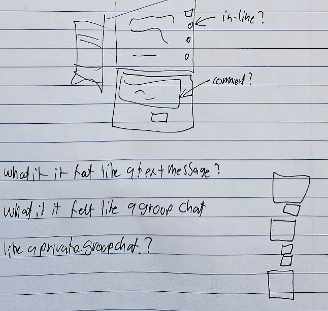

*[ Jarred 7.30am ]*

Good morning

I'm a little bit in-the-sea.

I'm not drowning because I'm not thrashing about and the waves are not so uppity.

It would be nice to get dry and to get warm though before I start working in earnest.

What do I mean by in the sea?

Well, I'm in the sea when my inner world is tangled in some way and it feels not-nice. Perhaps specifically when the not-nice feeling isn't clearly attributable to a cause that I can resolve.

This feels relevant to this research project although I couldn't say how for sure.

- - -

*[ Jarred 10.10am ]*

Well, I just spent 2-3 hours writing into [[day-4/appendices/jarred-margin]].

Some excepts if you don't feel like reading the whole thing:

> I was reading a Henrik Karlsson post this morning. It was on Idris Murdoc's essay's "The Sovereignty of the good over other concepts".

> Sophie once told me "Whenever I try to read a Henrik Karlsson post I can only get a couple sentences in before I have to stop. It's all too relevant and it makes me nauseous".

> I got to the part of the post where Henrik is relating the actual content of the philosophy and my working memory hit a sharp wall. There was a desire for the affordance to pause (via my headphone media controls or via speaking), to go back a couple sentences, to start indexing and actively metabolising what's been said by breaking it up into pieces and paraphrasing it.

> One angle on my bone is: "how it would feel to have a magic stack of index cards"

> These magic index cards are floating nearby at all times, or maybe live in my pocket, and just as I might move my hand I can will them out and into view.

> In my dream with a minor flick of my will I can play/pause or rewind. I can summon blank cards at will. I can say "ok, in simple sentences so what's been said so far is..."

> There's this great Wait but Why post where Tim Urban ([explains](https://waitbutwhy.com/2015/06/how-tesla-will-change-your-life.html) how he writes such great explainers. He talks about how he "builds the tree". That is, "If you want to explain something complex to someone you need to go right back to the basic and the obvious and build up a tree of context from there."

> "If you want to explain something complex to someone most of the communication will be reminding them of things they already know."
> "Ok, so remember the whole situation with A, B, C, D, E, F, and of course G?"
> "Ok, well turns out H and probably also I"
> "🤯"

>  One difficulty with things is that it's very rare for people to do this, and instead I must either ignore all the leaves or undertake the laborious process of building out the tree myself. One angle on my bone is that I want a system which helps me with this. I come across a golden leaf in an Idris Murdoch quote that's painful to just throw away but also there's no tree to put it on and it's somehow both very heavy and very fragile and I also need my hands to chop broccoli.

> In my dream I'd be able to make a room in my mind palace, and dedicate that room to the process of metabolising the leaves of this Henrik post, and the Idris quotes within it.

- - -

*[ Jarred 11.30am ]*

I sort of have a plan for something to ship. 

"what if comments felt like a group chat with friends?"

Probably not going to get near that today, but it's an interesting thought.

today's ideal features could be:

1. Introduce cards as a primitive rather than just "posts"
2. Add tooling to add cards to the post as comments
3. Add tooling to add cards to a personal margin using the librarian so i can add margin sections while chopping broccoli
4. Make the librarian easier to access so I don't have to go find it squirrelled away in day-2 or wherever it is

- - -

*[ Jarred 2.30pm ]*

Ok, we have comments!

I think that's enough to have count as shipped. It's not very exciting though.

Personal voice notes into the margin and allowing readers to leave google-doc style voice notes that the librarian can read, now that's interesting. Might be good to call that a day tho. I've been in ship-mode all day since Monday.

- - -

*[ Jarred 5.30pm ]*

Ok, that looks like it's working now. The duration is a bit bugged 😅 but I'd call that done for today.
